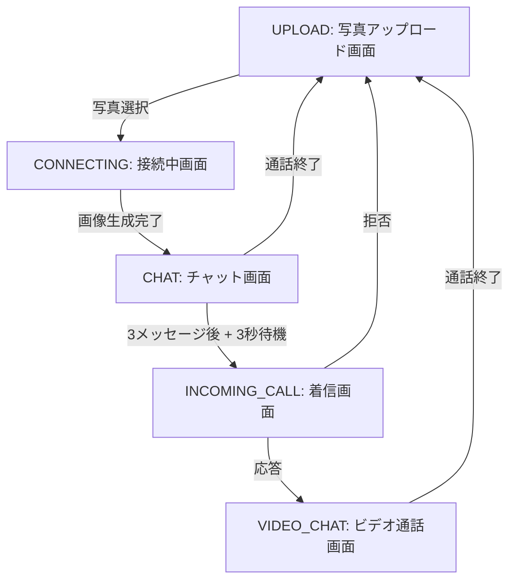

# 過去の自分とビデオ通話 - 詳細UXフロードキュメント

## 目次
1. [全体フロー概要](#全体フロー概要)
2. [画面遷移詳細](#画面遷移詳細)
3. [タイミング制御](#タイミング制御)
4. [会話ID管理システム](#会話id管理システム)
5. [API処理フロー](#api処理フロー)
6. [エラーハンドリング](#エラーハンドリング)
7. [状態管理](#状態管理)

---

## 全体フロー概要



---

## 画面遷移詳細

### 1. UPLOAD画面（初期画面）
**ファイル**: `components/UploadScreen.tsx`

#### 表示要素
- タイトル: "過去の自分とビデオ通話"
- 説明文: "今の自分の写真をアップロードして、過去の自分との対話を始めましょう。"
- アップロードボタン（カメラアイコン）
- ファイル選択input（非表示、クリックイベントで発火）

#### ユーザーアクション
1. **写真選択**
   - ボタンクリック → ファイル選択ダイアログ
   - 対応形式: image/* (JPEG, PNG, etc.)
   - 選択後の処理:
     ```typescript
     - FileReader APIで画像をBase64変換
     - onPhotoUpload(dataUrl)コールバック呼び出し
     - App.tsxでchildhoodPhotoに保存
     - 画面をCONNECTINGへ遷移
     ```

#### 遷移タイミング
- **即座に遷移**: 写真選択完了と同時にCONNECTING画面へ

---

### 2. CONNECTING画面（接続中・画像生成中）
**ファイル**: `components/ConnectingScreen.tsx`

#### 表示要素
- アップロードした写真（円形、128x128px）
- 写真上にオーバーレイ（半透明黒）
- パルスアニメーション（緑の点）
- テキスト表示（状態により変化）:
  - **converting状態**: "現在過去にタイムスリップしています..."
  - **その他**: "過去に接続中..."
- サブテキスト:
  - **converting状態**: "しばらくお待ちください。"
  - **その他**: "時間リンクを確立しています。しばらくお待ちください。"

#### 処理フロー（並列実行）

##### A. 画像生成処理
1. **開発環境（VITE_GEMINI_API_KEY設定時）**
   ```
   タイミング: コンポーネントマウント時
   処理時間: 実際のAPI応答時間（通常3-5秒）
   
   1. 画像をBase64から分解（mimeType + data）
   2. Gemini APIにプロンプトと画像送信
   3. 7歳の子供の姿に変換
   4. 変換結果をBase64形式で受信
   5. onConverted()で親コンポーネントに通知
   6. setStatus('done')
   7. onConnected()で画面遷移
   ```

2. **開発環境（APIキーなし）**
   ```
   タイミング: コンポーネントマウント時
   処理時間: 3.5秒（シミュレート）
   
   1. setStatus('converting')
   2. 3.5秒待機（setTimeout）
   3. 元画像をそのまま使用
   4. onConverted(photo)
   5. setStatus('done')
   6. 0.5秒後にonConnected()で遷移
   ```

3. **本番環境**
   ```
   タイミング: コンポーネントマウント時
   処理時間: サーバー応答時間
   
   1. /api/convertエンドポイントにPOST
   2. サーバー側でGemini API呼び出し
   3. 変換画像を受信
   4. 失敗時は元画像を使用（フォールバック）
   ```

##### B. 性別判定処理（並列実行）
1. **開発環境（VITE_OPENAI_API_KEY設定時）**
   ```
   タイミング: 画像生成と同時開始
   処理時間: 1-2秒（通常）
   
   1. OpenAI GPT-4o-miniモデル使用
   2. プロンプト: "性別を判定、male/femaleのみ回答"
   3. 結果をonGenderDetected()で通知
   4. ChatScreenで代名詞（僕/私）の決定に使用
   ```

2. **本番環境**
   ```
   1. /api/detect-genderエンドポイントにPOST
   2. サーバー側でOpenAI API呼び出し
   ```

3. **エラー時のフォールバック**
   ```
   デフォルト: 'male'
   ```

#### 遷移タイミング
- **画像生成完了時**: onConnected()が呼ばれCHAT画面へ
- **所要時間**: 通常3-5秒（APIキーなしの場合は4秒固定）

---

### 3. CHAT画面（初期チャット）
**ファイル**: `components/ChatScreen.tsx`

#### 初期化フロー

##### フェーズ1: 画面表示（0ms）
```
1. コンポーネントマウント
2. 空のメッセージ配列で画面描画
3. 上部に変換後の画像表示（または元画像）
4. 下部にチャット入力欄表示
```

##### フェーズ2: 初回メッセージ表示（800ms後）
```typescript
useEffect(() => {
  if (messages.length === 0) {
    const timer = setTimeout(() => {
      // 性別に基づいて代名詞決定
      const pronoun = detectedGender === 'female' ? '私' : '僕';
      
      // AIからの初回メッセージ生成
      const initialMessage: ChatMessage = {
        id: Date.now().toString(),
        sender: MessageSender.AI,
        text: `わあ！大きくなった${pronoun}だ！すごくびっくり！大人になったんだね...なんか疲れてない？でも嬉しいよ、会えて！`,
        conversationIndex: 1  // 会話ID: 1
      };
      
      setMessages([initialMessage]);
    }, 800);
  }
}, []);
```

#### 会話フロー

##### メッセージ1（AI → ユーザー）
- **会話ID**: 1
- **タイミング**: 画面表示から800ms後
- **内容**: 初回挨拶メッセージ
- **表示**: 左側の灰色バブル

##### メッセージ2（ユーザー → AI）
- **会話ID**: 2
- **タイミング**: ユーザー入力時
- **処理**:
  1. 入力テキストを取得
  2. conversationIndex: 2を付与
  3. メッセージ配列に追加（右側青バブル）
  4. OpenAI APIに送信

##### メッセージ3（AI → ユーザー）
- **会話ID**: 3
- **タイミング**: API応答受信時
- **処理**:
  1. GPT-4からの応答受信
  2. conversationIndex: 3を付与
  3. メッセージ配列に追加
  4. **重要**: 3メッセージ到達を検知

#### 画面遷移トリガー
```typescript
useEffect(() => {
  // 3メッセージ到達 + 最後がAIメッセージ
  if (messages.length >= 3 && onFirstChatComplete) {
    const lastMessage = messages[messages.length - 1];
    if (lastMessage.sender === MessageSender.AI) {
      const timer = setTimeout(() => {
        onFirstChatComplete(messages);  // 履歴を渡して遷移
      }, 3000); // 3秒待機
    }
  }
}, [messages, onFirstChatComplete]);
```

#### バックグラウンド処理
- **画像再変換**: 必要に応じてGemini APIで画像を再生成（品質向上）
- **処理タイミング**: チャット開始と同時
- **結果反映**: 生成完了時に画像を差し替え

---

### 4. INCOMING_CALL画面（着信画面）
**ファイル**: `components/IncomingCallScreen.tsx`

#### 表示要素
- 全画面の変換後画像（ぼかし効果付き背景）
- 中央に円形の子供の写真
- "幼い頃のあなた"テキスト
- "ビデオ通話..."サブテキスト
- アニメーション要素:
  - 写真の脈動（pulse）
  - リング状の波紋エフェクト
  - 着信音アイコンのアニメーション

#### ボタン配置
- **応答ボタン**（緑、電話アイコン）
  - 位置: 下部左側
  - アクション: onAnswer() → VIDEO_CHAT画面へ
  
- **拒否ボタン**（赤、電話切断アイコン）
  - 位置: 下部右側
  - アクション: onReject() → UPLOAD画面へリセット

#### タイミング
- **表示開始**: CHAT画面の3メッセージ後、3秒待機してから
- **自動応答**: なし（ユーザーアクション待ち）
- **チャット履歴**: 前画面から引き継ぎ

---

### 5. VIDEO_CHAT画面（ビデオ通話）
**ファイル**: `components/VideoChatScreen.tsx`

#### レイアウト構成

##### 上部40%: ビデオエリア
```
- 変換後の子供の写真を全画面表示
- オーバーレイ情報:
  - 名前: "幼い頃のあなた"
  - 通話時間: MM:SS形式（リアルタイム更新）
  - 終了ボタン（赤、右上）
```

##### 下部60%: チャットエリア
```
- メッセージリスト（スクロール可能）
  - 初期履歴3件を表示
  - 新規メッセージは下に追加
- 入力欄（下部固定）
  - プレースホルダー: "メッセージを入力..."
  - 送信ボタン（青、紙飛行機アイコン）
```

#### 会話の継続

##### 初期化
```typescript
const [messages, setMessages] = useState<ChatMessage[]>(initialHistory);
const conversationCounterRef = useRef<number>(initialHistory.length);
// 初期値は3（前画面の3メッセージ分）
```

##### メッセージ4以降
- **会話ID**: 4, 5, 6...と連番
- **処理フロー**:
  1. ユーザー入力 → conversationIndex: ++counter
  2. AI応答 → conversationIndex: ++counter
  3. 各メッセージにIDを付与して追跡可能

#### 音声合成（TTS）機能

##### 実装詳細
```typescript
const speakText = async (text: string) => {
  // 重複防止チェック
  if (lastSpokenTextRef.current === text) return;
  
  // OpenAI TTS API使用
  const response = await fetch('https://api.openai.com/v1/audio/speech', {
    model: 'tts-1',
    input: text,
    voice: gender === 'female' ? 'alloy' : 'nova',
    speed: 0.9
  });
  
  // 音声再生
  const audio = new Audio(audioUrl);
  await audio.play();
};
```

##### 音声タイミング
1. **初期メッセージ**: 画面表示から200ms後に最後のAIメッセージを読み上げ
2. **新規AIメッセージ**: 受信と同時に自動読み上げ
3. **重複防止**: 同じテキストは読み上げない
4. **音声停止**: 画面遷移時に自動停止

#### 会話段階に応じた動的システムプロンプト

##### 三段論法による説得戦略
```typescript
// utils/conversationStrategy.ts
export enum ConversationStage {
  EMPATHY = 'empathy',        // 共感段階（会話5-7）
  REALIZATION = 'realization', // 気づき段階（会話8-10）
  ACTION = 'action'           // 行動段階（会話11+）
}

// 会話段階に応じたプロンプト生成
const getSystemInstruction = () => {
  const fullHistory = [...initialHistory, ...messages.slice(initialHistory.length)];
  return persuasionManagerRef.current.getCurrentPrompt(gender);
};
```

##### 段階別の対話戦略

**共感フェーズ（会話5-7）**
- 大人の自分が頑張っていることを認める
- 子供の頃の夢や希望について聞く
- 「大丈夫？」「疲れてない？」など心配を示す
- 純粋な好奇心で質問する

**気づきフェーズ（会話8-10）**
- 「昔の僕/私だったら〜って言ってたよ」と過去を思い出させる
- 「なんで変わっちゃったの？」と純粋に疑問を投げかける
- 「本当はまだ〜したいんでしょ？」と本心を引き出す
- 子供ならではの単純明快な視点で核心をつく

**行動フェーズ（会話11+）**
- 「僕/私と約束して！」と具体的な約束を求める
- 「明日から〜してみて！」と小さな一歩を提案
- 「大人の僕/私ならできるよね？」と信頼を示す
- 最後は「約束だよ！指切りげんまん！」で締める

##### 会話段階の移行ログ
```typescript
if (aiMessage.conversationIndex === 7) {
  console.log('🎯 共感フェーズ完了！気づきフェーズへ移行');
} else if (aiMessage.conversationIndex === 10) {
  console.log('💡 気づきフェーズ完了！行動変容フェーズへ');
} else if (aiMessage.conversationIndex >= 11) {
  console.log('🚀 行動変容を促す段階 - ユーザーの約束を引き出す');
}
```

---

## タイミング制御

### 重要な待機時間一覧

| 処理 | 待機時間 | 場所 | 目的 |
|-----|---------|------|------|
| 初回AIメッセージ表示 | 800ms | ChatScreen | 画面表示後の自然な間 |
| 着信画面への遷移 | 3000ms | ChatScreen | 3メッセージ後の待機 |
| 画像生成シミュレート | 3500ms | ConnectingScreen | 開発環境での擬似処理 |
| 完了表示 | 500ms | ConnectingScreen | "done"状態の表示時間 |
| TTS初回読み上げ | 200ms | VideoChatScreen | 画面遷移後の安定待ち |

### 非同期処理の並列化

```
CONNECTING画面での並列処理:
┌─────────────────────────────────────┐
│  画像生成API (3-5秒)                   │
├─────────────────────────────────────┤
│  性別判定API (1-2秒)                   │
└─────────────────────────────────────┘
         ↓ 両方完了後
      CHAT画面へ遷移
```

---

## 会話ID管理システム

### 実装概要

#### データ構造
```typescript
export interface ChatMessage {
  id: string;                    // 一意識別子
  sender: MessageSender;          // AI or USER
  text: string;                   // メッセージ本文
  conversationIndex?: number;     // 会話順序番号（内部管理用）
}
```

#### カウンター管理
```typescript
// ChatScreen.tsx
const conversationCounterRef = useRef<number>(0);

// VideoChatScreen.tsx  
const conversationCounterRef = useRef<number>(initialHistory.length);
```

### 会話IDの用途

1. **画面遷移制御**
   - ID 3到達後 → INCOMING_CALL画面へ

2. **三段論法による説得フェーズ管理**
   - ID 1-3: 初期対話フェーズ（ChatScreen）
   - ID 4: ビデオ通話開始メッセージ
   - ID 5-7: 共感フェーズ（過去の夢や希望を聞き、共感を示す）
   - ID 8-10: 気づきフェーズ（現在と過去のギャップに優しく気づかせる）
   - ID 11+: 行動フェーズ（具体的な行動変容を促す、約束を引き出す）

3. **分析・デバッグ**
   - 会話の流れを追跡
   - 特定ポイントでの処理実行
   - 説得段階の進行状況を管理

### インクリメントルール
```typescript
// ユーザーメッセージ送信時
const newUserMessage: ChatMessage = {
  conversationIndex: ++conversationCounterRef.current
};

// AI応答受信時
const aiMessage: ChatMessage = {
  conversationIndex: ++conversationCounterRef.current  
};
```

---

## API処理フロー

### OpenAI API（チャット）

#### エンドポイント
- **開発**: 直接API呼び出し（dangerouslyAllowBrowser: true）
- **本番**: `/api/chat`経由

#### リクエスト構造
```typescript
{
  model: 'gpt-4',
  messages: [
    { role: 'system', content: systemInstruction },
    { role: 'user/assistant', content: '...' },
    // 会話履歴
  ],
  max_tokens: 150,
  temperature: 0.8
}
```

#### システムプロンプト（動的生成）

**基本設定（全段階共通）**
```
あなたは写真の子供（5-7歳）として、大人になった自分と話しています。
- 敬語は使わず、子供らしい話し方をする
- 「〜だよ」「〜なんだ」などの語尾を使う
- 好奇心旺盛で、感情豊かに反応する
- 大人の自分を「未来の僕/私」と呼ぶことがある
```

**段階別の追加指示**
- **共感フェーズ**: 相手の気持ちに寄り添い、深い共感を示す
- **気づきフェーズ**: 優しく、でも鋭い観察で気づきを与える
- **行動フェーズ**: 具体的な約束や行動変容を自然に引き出す

システムプロンプトは会話履歴と段階に応じて動的に生成され、一貫性のある対話を実現します。

### Google Gemini API（画像変換）

#### モデル
- `gemini-2.5-flash-image-preview`

#### プロンプト
```
Using the provided image, create a photorealistic portrait 
of this person as a 7-year-old child...
- Smooth, youthful skin with rounder cheeks
- Proportionally larger eyes with innocent gaze
- Simple elementary school outfit
- Ultra photorealistic quality
```

#### レスポンス処理
```typescript
// Base64画像データの抽出
const candidates = data?.candidates || [];
for (const c of candidates) {
  const parts = c?.content?.parts || [];
  for (const p of parts) {
    if (p?.inlineData?.data) {
      // 変換画像を取得
    }
  }
}
```

### OpenAI TTS API（音声合成）

#### 設定
```typescript
{
  model: 'tts-1',
  input: text,
  voice: gender === 'female' ? 'alloy' : 'nova',
  response_format: 'mp3',
  speed: 0.9  // 少しゆっくり
}
```

---

## エラーハンドリング

### API失敗時のフォールバック

#### 画像変換失敗
```typescript
try {
  // Gemini API呼び出し
} catch (error) {
  // 元画像をそのまま使用
  onConverted(photo);
}
```

#### 性別判定失敗
```typescript
try {
  // OpenAI API呼び出し
} catch (error) {
  // デフォルト'male'を使用
  onGenderDetected('male');
}
```

#### チャット失敗
```typescript
catch (error) {
  const errorMessage: ChatMessage = {
    text: 'あれ？ちょっと聞こえなかった。もう一回言って？'
  };
}
```

#### TTS失敗
```typescript
catch (error) {
  // 音声なしで続行（サイレントフォールバック）
  console.error('TTS error:', error);
}
```

### ユーザー体験の維持
- エラー時も機能は継続
- 適切なフォールバック値を使用
- エラーメッセージは子供のキャラクターを維持

---

## 状態管理

### App.tsx（グローバル状態）

```typescript
const [appState, setAppState] = useState<AppState>({ 
  screen: Screen.UPLOAD 
});
const [childhoodPhoto, setChildhoodPhoto] = useState<string | null>(null);
const [convertedPhoto, setConvertedPhoto] = useState<string | null>(null);
const [chatHistory, setChatHistory] = useState<ChatMessage[]>([]);
const [detectedGender, setDetectedGender] = useState<'male' | 'female'>('male');
```

### 状態の流れ

```
UPLOAD → childhoodPhoto設定
  ↓
CONNECTING → convertedPhoto生成、gender判定
  ↓
CHAT → chatHistory蓄積（3メッセージ）
  ↓
INCOMING_CALL → chatHistory保持
  ↓
VIDEO_CHAT → chatHistory継続、新規メッセージ追加
```

### リセット処理
```typescript
const handleEndCall = useCallback(() => {
  setChildhoodPhoto(null);
  setConvertedPhoto(null);
  setChatHistory([]);
  setAppState({ screen: Screen.UPLOAD });
}, []);
```

---

## パフォーマンス最適化

### 実装済みの最適化

1. **並列API呼び出し**
   - 画像変換と性別判定を同時実行
   - 待機時間を最小化

2. **遅延ロード**
   - 初回メッセージを800ms遅延
   - 自然なUXを実現

3. **音声の重複防止**
   - 同一テキストの再読み上げを防止
   - リソース使用を最適化

4. **メモ化**
   - useCallbackでコールバック関数を最適化
   - 不要な再レンダリングを防止

### 今後の最適化候補

1. **画像の事前処理**
   - アップロード時にリサイズ
   - API送信サイズを削減

2. **キャッシュ戦略**
   - 変換画像のローカル保存
   - 同一画像の再変換防止

3. **ストリーミング応答**
   - チャット応答の逐次表示
   - 体感速度の向上

---

## デバッグ情報

### ログポイント

```typescript
// 会話ID到達ログ
console.log(`会話ID ${conversationIndex} に到達`);

// API呼び出しログ
console.log('画像変換API呼び出し開始');
console.log('性別判定結果:', gender);

// 状態遷移ログ
console.log(`画面遷移: ${oldScreen} → ${newScreen}`);
```

### 開発環境の切り替え

```bash
# APIキーなしでの動作確認
VITE_OPENAI_API_KEY="" npm run dev

# 完全機能での動作確認  
VITE_OPENAI_API_KEY="sk-..." VITE_GEMINI_API_KEY="..." npm run dev
```

---

## まとめ

このアプリケーションは、複数の非同期処理を巧みに組み合わせ、自然なユーザー体験を実現しています。特に重要なのは：

1. **タイミング制御**: 各画面遷移に適切な待機時間を設定
2. **並列処理**: API呼び出しを並列化して待機時間を最小化
3. **会話ID管理**: 内部的な会話フロー制御を実現
4. **エラー耐性**: 適切なフォールバックで機能継続性を確保
5. **キャラクター維持**: エラー時も子供のキャラクターを保持

これらの要素が組み合わさることで、「過去の自分との感動的な対話」という独特な体験を提供しています。